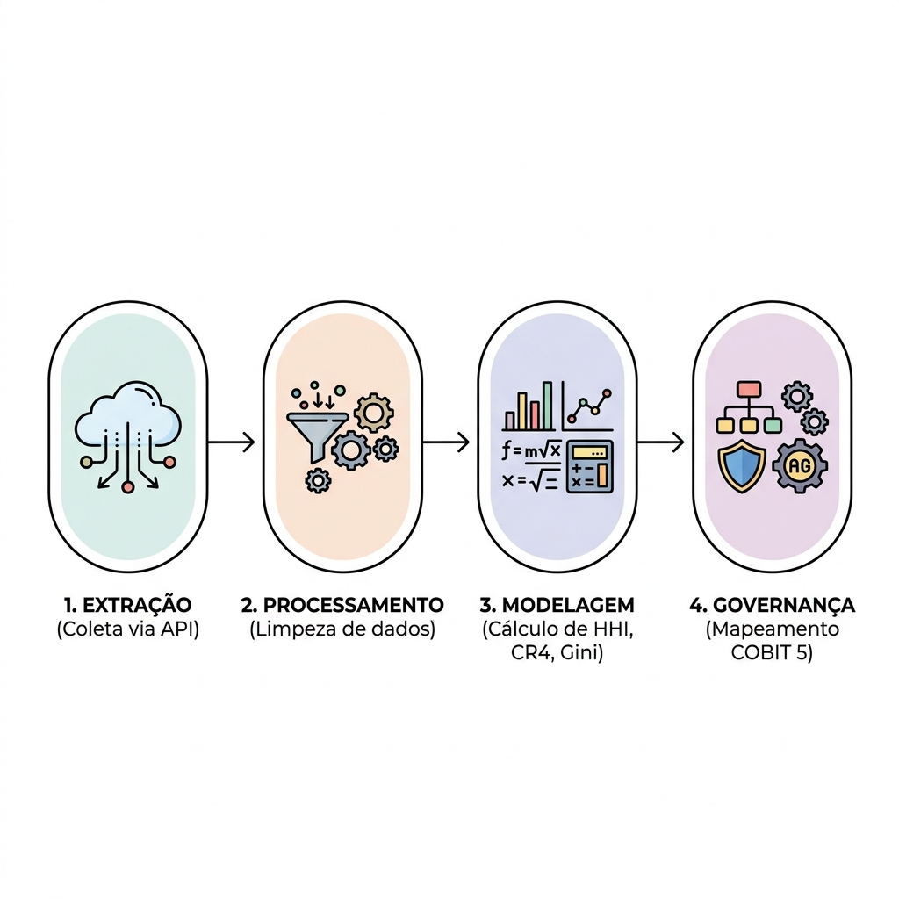

# 3 PROCEDIMENTO METODOLÓGICO

Esta seção detalha o arcabouço metodológico empregado para avaliar a governança de TI e os níveis de concentração de mercado nas contratações de Fábrica de Software realizadas no setor público federal brasileiro. O desenho da pesquisa caracteriza-se como um estudo empírico-analítico, de natureza quantitativa e qualitativa, fundamentado em dados secundários oficiais obtidos do portal governamental Compras.gov.br no recorte temporal de 2024 a 2026. 

A padronização temporal para o período de 2024 a 2026 justifica-se pela necessidade de garantir a homogeneidade metodológica e jurídica do corpus de análise. Esse intervalo compreende o período em que a Nova Lei de Licitações e Contratos Administrativos (Lei nº 14.133/2021) passou a vigorar de forma plena e exclusiva, após a revogação das normas anteriores (como a Lei nº 8.666/1993) ocorrida no final de 2023 (BRASIL, 2021). Esse recorte minimiza distorções estruturais decorrentes de transições legislativas e regimes de contratação distintos.

Para facilitar a compreensão do pipeline de pesquisa desenvolvido neste trabalho, a Figura 1 ilustra de forma sintetizada as quatro etapas centrais que ligam a captura dos dados primários à avaliação final dos indicadores de governança:

<small><b>Figura 1</b> – Processo de pesquisa</small>

  

<small>Fonte: Autor (2026)</small>

---

## 3.1 Coleta de dados via API de dados abertos

A coleta de dados brutos foi realizada por meio do consumo programático da API de Dados Abertos do Governo Federal, sob o domínio oficial `https://dadosabertos.compras.gov.br`. Especificamente, utilizou-se o endpoint `/modulo-pesquisa-preco/3_consultarServico`, projetado para retornar registros detalhados sobre contratações públicas de serviços.

Para mitigar a ocorrência de viés de amostragem e assegurar a integridade do corpus de pesquisa, implementou-se um mecanismo de busca automatizada programado em Python. Essa solução percorre sistematicamente todas as páginas de resultados fornecidas pelo portal governamental até que o universo total de contratações de serviços seja extraído de forma completa. Na prática, essa abordagem funciona como uma varredura integral que coleta os dados de forma exaustiva e sequencial, assegurando que nenhum contrato assinado no período delimitado seja omitido do estudo. Essa integridade nos dados de origem permite que as análises subsequentes reflitam o comportamento real e integral do mercado público federal de software.

---

## 3.2 Filtro e extração estruturada (códigos CATSER)

O Catálogo de Serviços (CATSER) constitui o sistema oficial de classificação e codificação de serviços adotado pela Administração Pública Federal brasileira. Semelhante ao Catálogo de Materiais (CATMAT), o CATSER funciona como um dicionário estruturado e padronizado que visa catalogar e identificar de maneira unívoca cada serviço contratado pelos órgãos federais. Essa codificação é essencial para eliminar ambiguidades descritivas — por exemplo, permitindo diferenciar a contratação de desenvolvimento de novos sistemas da mera prestação de suporte técnico ou manutenção de computadores —, facilitando a comparação de preços praticados e a transparência concorrencial.

Para este estudo, o escopo amostral foi delimitado a partir de 14 códigos CATSER específicos associados diretamente às atividades de Fábrica de Software. Os códigos foram selecionados e organizados com base em duas grandes macroatividades operacionais: *Desenvolvimento de Novo Software* e *Manutenção Evolutiva de Software*, subdivididos por pilhas tecnológicas (*stacks*), conforme detalhado na Tabela 1:

<small><b>Tabela 1</b> – Classificação dos códigos CATSER de Fábrica de Software analisados</small>

| Código CATSER | Macroatividade | Stack Tecnológica / Descrição no Catálogo |
| :--- | :--- | :--- |
| **25852** | Desenvolvimento | Desenvolvimento de Novo Software - Java |
| **25860** | Desenvolvimento | Desenvolvimento de Novo Software - PHP |
| **25879** | Desenvolvimento | Desenvolvimento de Novo Software - .NET, ASP, Delphi, VB ou C++ |
| **25895** | Desenvolvimento | Desenvolvimento de Novo Software - Linguagens Web (Python, Ruby etc) |
| **25887** | Desenvolvimento | Desenvolvimento de Novo Software - Mobile (Android, iOS) |
| **25909** | Desenvolvimento | Desenvolvimento de Novo Software - Mainframe |
| **25917** | Desenvolvimento | Desenvolvimento de Novo Software - Outras Linguagens |
| **25925** | Manutenção | Manutenção Evolutiva de Software - Java |
| **25933** | Manutenção | Manutenção Evolutiva de Software - PHP |
| **25941** | Manutenção | Manutenção Evolutiva de Software - .NET, ASP, Delphi, VB ou C++ |
| **25968** | Manutenção | Manutenção Evolutiva de Software - Linguagens Web (Python, Ruby etc) |
| **25950** | Manutenção | Manutenção Evolutiva de Software - Mobile (Android, iOS) |
| **25976** | Manutenção | Manutenção Evolutiva de Software - Mainframe |
| **25984** | Manutenção | Manutenção Evolutiva de Software - Outras Linguagens |

<small>Fonte: Elaborado pelo autor com base nos dados do Compras.gov.br (2026)</small>

Após a extração, realizou-se a deduplicação dos dados a partir do campo `idItemCompra` da API oficial, evitando que o mesmo registro fosse contabilizado de forma duplicada em consultas de CATSERs sobrepostos. Em seguida, os itens de contratação foram agregados sob a chave identificadora do contrato (`idCompra`), permitindo o cálculo do valor financeiro real transacionado por instrumento contratual no período de 2024 a 2026.

---

## 3.3 Tratamento de dados e cálculo das proxies de mercado

Para mensurar quantitativamente a concentração do mercado público de Fábrica de Software, três indicadores foram selecionados e calculados para cada código CATSER por ano de assinatura contratual:

### 3.3.1 Índice de Herfindahl-Hirschman (HHI)
O HHI é amplamente utilizado por órgãos de defesa econômica (como o Departamento de Justiça dos EUA e o CADE no Brasil) para avaliar o nível de concorrência em setores produtivos. O cálculo consiste no somatório dos quadrados das participações de mercado (*market shares*) de todas as firmas atuantes no setor:

$$HHI = \sum_{i=1}^{n} s_i^2$$

Onde:
- $s_i$ representa a participação percentual de faturamento da empresa $i$ no faturamento total do código CATSER analisado naquele ano de referência ($s_i \in [0, 100]$);
- $n$ denota o número total de fornecedores ativos que obtiveram contratos para o respectivo CATSER.

O HHI varia em um intervalo entre $0$ (concorrência perfeita teórica com infinitas firmas de tamanho infinitesimal) e $10.000$ (cenário de monopólio pleno). Adotou-se a classificação paramétrica padrão para análise setorial:
1. **HHI < 1.500**: Mercado competitivo, indicando baixo risco de dependência ou baixa concentração;
2. **1.500 $\le$ HHI $\le$ 2.500**: Concentração moderada;
3. **HHI > 2.500**: Mercado altamente concentrado, sugerindo vulnerabilidade crítica em termos de governança pública devido à reduzida diversidade de prestadores.

### 3.3.2 Razão de concentração dos quatro maiores fornecedores (CR4)
A métrica CR4 quantifica a soma das participações de mercado das quatro maiores empresas em faturamento dentro de um mesmo CATSER em determinado ano:

$$CR4 = \sum_{i=1}^{\min(4, n)} s_i$$

Onde as participações de mercado $s_i$ estão organizadas em ordem decrescente ($s_1 \ge s_2 \ge \dots \ge s_n$). O índice varia de $0$ a $100\%$, em que valores superiores a $75\%$ costumam indicar uma estrutura de mercado oligopolista altamente concentrada, sinalizando potencial dependência sistêmica em relação a poucos prestadores de serviços de software.

### 3.3.3 Coeficiente de Gini
Utilizado de forma complementar para avaliar a desigualdade na distribuição de faturamento entre os fornecedores de cada stack tecnológica, o Coeficiente de Gini foi computado com base na seguinte equação:

$$G = \frac{2 \sum_{i=1}^{n} i \cdot y_i}{n \sum_{i=1}^{n} y_i} - \frac{n + 1}{n}$$

Onde:
- $y_i$ indica o faturamento acumulado do fornecedor $i$ no ano de análise, ordenado de forma ascendente ($y_1 \le y_2 \le \dots \le y_n$);
- $i$ expressa a posição ou posto do fornecedor no ordenamento de faturamento ($i \in [1, n]$);
- $n$ refere-se ao número total de fornecedores que receberam recursos no âmbito do CATSER.

O coeficiente estende-se em um espectro contínuo de $0$ (perfeita igualdade de faturamento entre fornecedores ativos) a $1$ (máxima desigualdade, na qual uma única empresa monopoliza a receita gerada). A combinação de um HHI elevado com um Gini alto sugere cenários críticos para a governança, onde uma única organização detém fatias desproporcionais do orçamento federal disponível para determinada tecnologia.

---

## 3.4 Modelagem estatística

Para além da descrição paramétrica básica dos índices de concentração, aplicou-se modelagem estatística não-paramétrica para testar hipóteses sobre o comportamento orçamentário e a distribuição de concorrência. Os testes não-paramétricos são justificados pela não-aderência dos dados financeiros públicos à distribuição normal (anomalia comumente observada em orçamentos públicos, caracterizada por assimetria positiva severa e caudas longas).

### 3.4.1 Coeficiente de correlação de Spearman ($\rho$)
Aplicou-se o teste de Spearman para avaliar a hipótese de associação monótona entre o volume total anual de faturamento de cada CATSER ($X$) e o seu correspondente nível de concentração quantificado pelo HHI ($Y$). O coeficiente baseia-se na correlação de postos (*ranks*):

$$\rho = 1 - \frac{6 \sum d_i^2}{N(N^2 - 1)}$$

Onde $d_i$ corresponds à diferença entre os postos das variáveis para a observação $i$, e $N$ representa o número total de observações pareadas. Esse teste busca validar se o aumento do investimento orçamentário público em determinada stack tecnológica atua como fator de mitigação de concentração de mercado, atraindo maior concorrência e reduzindo o HHI.

### 3.4.2 Teste de Kruskal-Wallis
O teste de Kruskal-Wallis foi adotado com o objetivo de analisar se as distribuições de faturamento anual dos contratos de Fábrica de Software mantêm homogeneidade temporal no decorrer do período pós-transição regulatória (2024, 2025 e 2026). Trata-se de uma análise de variância não-paramétrica de um fator:

$$H = \frac{12}{N(N+1)} \sum_{j=1}^{k} \frac{R_j^2}{n_j} - 3(N+1)$$

Onde:
- $k$ é o número de grupos a serem comparados ($k=3$, representando os anos de 2024, 2025 e 2026);
- $n_j$ indica o número de contratos celebrados no ano $j$;
- $N$ é o número acumulado de contratos no período ($N = \sum n_j$);
- $R_j$ é a soma dos postos (*ranks*) atribuídos aos valores de contrato do ano $j$.

O teste visa rejeitar ou falhar em rejeitar a hipótese nula ($H_0$) de que os valores contratuais de Fábrica de Software no setor federal pertencem a populações com distribuições idênticas. A estabilidade estatística temporal do faturamento orçamentário no recorte estabelecido sugere a consolidação jurídica proporcionada pela vigência plena da Lei nº 14.133/2021, estabilizando as práticas licitatórias governamentais.

---

## 3.5 Abordagem teórico-analítica: mapeamento de governança

Para contextualizar a análise matemática no campo da governança pública, os resultados quantitativos (HHI, CR4, Gini) foram associados a modelos consolidados de gestão pública e de TI. 

Sob a ótica do *New Public Management* (HOOD, 1991), que preconiza a contratualização e a busca pela eficiência mercadológica no serviço público, a contratação de Fábrica de Software representa uma estratégia para otimizar custos institucionais. Contudo, a teoria da regulação econômica sugerida por Stigler (1971) adverte sobre o risco de captura de processos governamentais por interesses privados organizados, o que pode se manifestar em mercados públicos altamente concentrados. Para contornar essa vulnerabilidade, a perspectiva da *New Public Governance* (OSBORNE, 2006) destaca a governança integrada de redes de fornecedores como fator indispensável para garantir resiliência aos serviços digitais prestados pelo Estado.

Com base nessas correntes teóricas, as métricas computadas foram mapeadas diretamente em dois processos centrais do framework de governança COBIT 5 (ISACA, 2012):

1. **APO10 (Gestão de Fornecedores)**: Onde os índices HHI e CR4 atuam como indicadores objetivos do risco de aprisionamento tecnológico (*Vendor Lock-In*). Em stacks de software onde poucas empresas detêm a quase totalidade dos contratos, o poder de barganha do governo federal pode sofrer mitigações, limitando a obtenção de termos contratuais favoráveis e dificultando a transição de fornecedores sem interrupções críticas.
2. **APO12 (Gestão de Riscos)**: Onde a combinação de elevado Gini e alto HHI serve como métrica de risco sistêmico operacional. A dependência excessiva em relação a um grupo oligopolista expõe a administração pública a potenciais interrupções de serviços fundamentais de software no caso de insolvência financeira de parceiros privados ou comportamento colusivo, justificando a adoção de planos de contingência robustos por parte dos gestores públicos.
