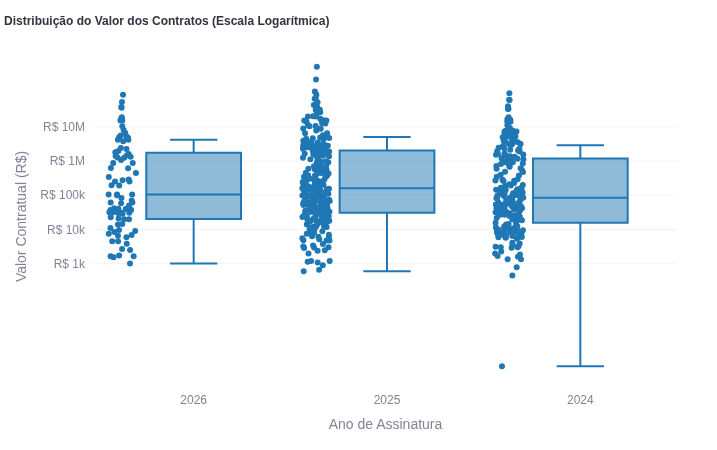
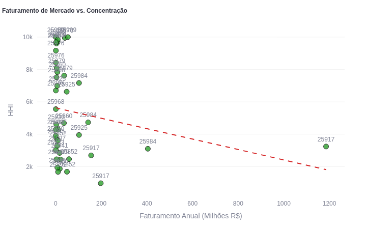
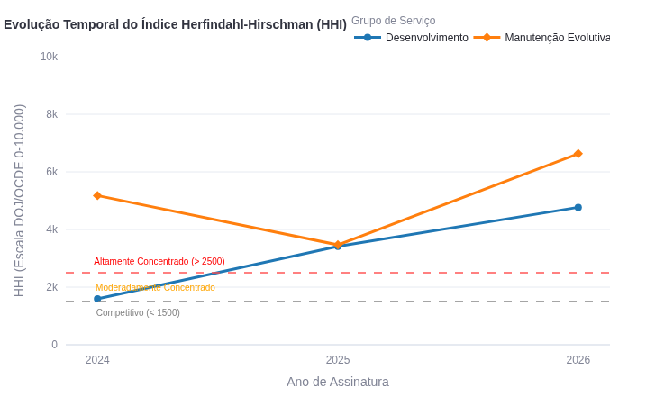
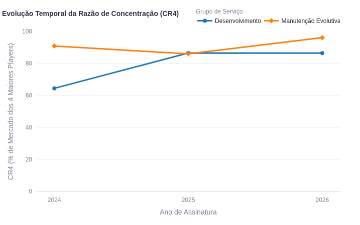
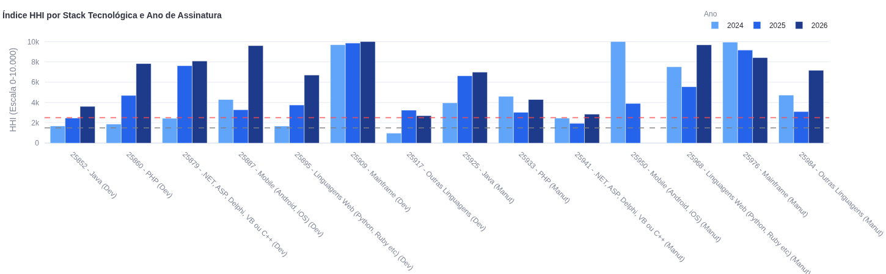
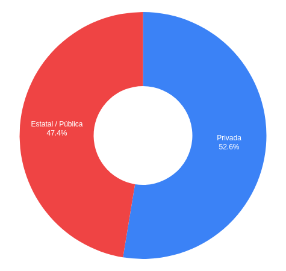
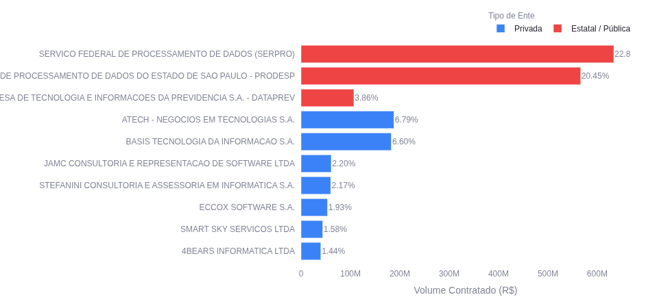

# 4. Análise e Resultados

Os resultados extraídos da plataforma de visualização de dados (*dashboard*) desenvolvida para este estudo sugerem um panorama complexo acerca da competitividade nas contratações de Fábricas de Software na Administração Pública Federal. Inicialmente, faz-se necessário destacar as limitações inerentes ao escopo da amostra e ao tratamento metodológico. Observa-se que os dados referentes ao ano de 2026 contemplam apenas o primeiro semestre, o que pode introduzir vieses sazonais ou distorções na análise longitudinal. Adicionalmente, ressalta-se a importância da escolha do método de agregação para o cálculo do Índice Herfindahl-Hirschman (HHI). A utilização de médias aritméticas simples sugere atribuir peso idêntico a todas as tecnologias (CATSERs), o que pode superestimar a influência de nichos com baixíssima contratação financeira. Por outro lado, a adoção da média ponderada pelo faturamento apresenta indícios de uma representação mais fidedigna da relevância econômica, mitigando potenciais distorções dos dados, mas exige cautela interpretativa ao focar prioritariamente nos grandes orçamentos.

---

## 4.1 Panorama Geral das Contratações de Fábrica de Software (2024-2026)

O período pós-transição regulatória (2024-2026), marcado pela vigência exclusiva da Nova Lei de Licitações e Contratos Administrativos (Lei nº 14.133/2021), exibe volumes expressivos de recursos públicos direcionados à contratação de Fábricas de Software. Os dados agregados apontam para um mercado que movimenta centenas de milhões de reais anualmente, porém com uma distribuição contratual marcadamente desigual. 

Para compreender as características estruturais dessa distribuição, aplicou-se a modelagem de inferência não-paramétrica. O teste de Kruskal-Wallis (representado pela dispersão dos *boxplots* da Figura 1) sinaliza eventuais flutuações estruturais na distribuição dos valores contratuais.

**Figura 1 - Distribuição do Valor dos Contratos (Escala Logarítmica)**

*Fonte: Elaborado pelo autor (2026).*

A Figura 1 demonstra que as medianas dos contratos mantêm-se relativamente estáveis na faixa de R$ 100 mil, porém observa-se uma vasta incidência de *outliers* milionários que distorcem o faturamento médio. A instabilidade estatística acusada pelo Kruskal-Wallis (p-valor < 0,05) sugere que os valores praticados sofreram variações significativas de distribuição no período, impulsionadas pela presença dessas contratações de grande escala, que representam a maior parte do orçamento licitado. 

Essa assimetria é ainda mais evidente quando analisada sob a ótica concorrencial. A correlação de Spearman, ilustrada na Figura 2, apresenta a relação entre o faturamento anual do mercado e o nível de concentração (HHI).

**Figura 2 - Correlação de Spearman: Faturamento de Mercado vs. Concentração**

*Fonte: Elaborado pelo autor (2026).*

A linha de tendência decrescente da Figura 2 indica a possibilidade de uma correlação negativa entre faturamento total e HHI. Em termos conceituais, isso sugere que mercados menores (com baixo volume licitado) tendem a apresentar índices de concentração extremos (HHI próximo a 10.000), caracterizando monopólios de nicho. Por outro lado, à medida que o volume financeiro cresce, a concorrência se eleva e o HHI diminui. Contudo, mesmo em mercados de faturamento expressivo (como o CATSER 25917), os patamares de concentração ainda se encontram acima de 2.000 pontos, indicando que a atratividade econômica não é suficiente para fragmentar completamente o poder de mercado de grandes fornecedores.

---

## 4.2 Análise Comparativa de Concentração: Desenvolvimento vs. Manutenção Evolutiva

A separação metodológica entre as macroatividades de *Desenvolvimento de Novo Software* e *Manutenção Evolutiva de Software* revela dinâmicas concorrenciais distintas na administração federal. As Figuras 3 e 4 ilustram, respectivamente, a evolução do Índice Herfindahl-Hirschman (HHI) e da Razão de Concentração (CR4) para ambos os grupos.

**Figura 3 - Evolução Temporal do Índice Herfindahl-Hirschman (HHI)**

*Fonte: Elaborado pelo autor (2026).*

**Figura 4 - Evolução Temporal da Razão de Concentração (CR4)**

*Fonte: Elaborado pelo autor (2026).*

Conforme ilustra a Figura 3, o segmento de "Manutenção Evolutiva" demonstra patamares historicamente elevados de concentração, posicionando-se frequentemente acima do limiar crítico de 2.500 pontos. Essa tendência é respaldada pela Figura 4, na qual o CR4 da "Manutenção" inicia na casa dos 90% em 2024 e atinge aproximadamente 95% no período parcial de 2026. A manutenção de sistemas legados impõe barreiras de entrada elevadas, como a exigência de conhecimento de arquiteturas proprietárias e atestados de capacidade específicos, restringindo o mercado a um grupo seleto de empresas.

Já o segmento de "Desenvolvimento" aponta para uma trajetória de consolidação acelerada. Embora tenha iniciado o período em níveis de concentração moderada (HHI entre 1.500 e 2.000 pontos e CR4 de 65% em 2024), os dados sugerem uma tendência acentuada de elevação, culminando em um CR4 superior a 85% em 2026. Esse comportamento indica a possibilidade de que as regras da Lei nº 14.133/2021 — que priorizam a padronização e a consolidação de compras — estejam favorecendo a adjudicação de contratos a grandes consórcios e empresas de grande porte, reduzindo o espaço de atuação para pequenos e médios fornecedores no ecossistema de desenvolvimento de novos sistemas.

---

## 4.3 Análise por Stack Tecnológica (Java vs. .NET vs. PHP vs. Web/Mobile/Mainframe)

O detalhamento dos indicadores por código CATSER revela assimetrias críticas entre as tecnologias demandadas pela Administração Pública. Os dados indicam que stacks consolidadas e nichos legados operam sob lógicas concorrenciais distintas. Para fundamentar essa desagregação, a Figura 5 ilustra de forma comparativa o comportamento do HHI ao longo do período analisado para cada código de serviço.

**Figura 5 - Índice HHI por Stack Tecnológica e Ano de Assinatura**

*Fonte: Elaborado pelo autor (2026).*

A visualização detalhada na Figura 5 sugere um avanço concorrencial preocupante. Em quase todas as pilhas tecnológicas analisadas, há uma trajetória ascendente de concentração do faturamento. Vários CATSERs superam o limiar crítico de 2.500 pontos, indicando mercados altamente concentrados e sujeitos a riscos severos de oligopolização ou monopólio.

### 4.3.1 O Caso Crítico do Mainframe
As contratações relacionadas à tecnologia de *Mainframe* (CATSERs 25909 e 25976) representam o ponto de maior vulnerabilidade concorrencial. O HHI para Desenvolvimento em Mainframe (25909) manteve-se próximo ao limite máximo de concentração em 2024 (9.840) e 2025 (9.848), atingindo a marca de **10.000 pontos (monopólio absoluto)** em 2026, com faturamento concentrado em um único fornecedor ativo para um volume contratado de R$ 53,4 milhões. A manutenção evolutiva (25976) segue comportamento similar, registrando HHI de 9.166 em 2025. Esse comportamento sugere que a obsolescência tecnológica atua como uma barreira de entrada intransponível para novos *players*, forçando o Estado a depender de prestadores monopolistas.

### 4.3.2 A Concentração nas Stacks Tradicionais (Java, .NET e PHP)
As linguagens tradicionalmente utilizadas em sistemas governamentais também exibem tendências severas de concentração ao longo dos anos:
- **Java**: Stack historicamente predominante no setor público. No Desenvolvimento (25852), o HHI subiu de 1.691 (2024) para 3.613 (2026), com redução drástica de 14 para apenas 3 fornecedores ativos. Na Manutenção (25925), o HHI saltou de 1.954 (2024) para 6.986 (2026), restando apenas 2 fornecedores ativos na base de dados.
- **.NET**: No Desenvolvimento (25879), o HHI registrou aumento de 1.821 (19 fornecedores em 2024) para 8.086 (apenas 2 fornecedores ativos em 2026), refletindo um oligopólio quase total (CR4 de 100%).
- **PHP**: Acompanhando a tendência, o HHI para Desenvolvimento (25860) subiu de 1.834 (2024) para 7.836 (2026), indicando uma consolidação acelerada do faturamento em poucos fornecedores.

### 4.3.3 Tecnologias Modernas (Linguagens Web e Mobile)
Mesmo as pilhas tecnológicas associadas a conceitos modernos de desenvolvimento não escapam da consolidação concorrencial:
- **Linguagens Web (Python, Ruby, etc.)**: No Desenvolvimento (25895), o HHI cresceu de 2.016 (2024) para 6.701 (2026). Na Manutenção (25968), o indicador alcançou a marca crítica de 9.681 em 2026, com apenas 2 fornecedores ativos.
- **Mobile**: O Desenvolvimento Mobile (25887) alcançou HHI de 9.601 em 2026 (CR4 de 100%), sugerindo que a especificidade técnica de entregas para dispositivos móveis tem concentrado as contratações públicas em um número restrito de especialistas de grande porte.

Em suma, observa-se que, independentemente da stack tecnológica ser legada (Mainframe) ou moderna (Web/Mobile), há um padrão consistente de retração no número de concorrentes e de elevação dos índices de concentração financeira (HHI e Gini) de 2024 para 2026.

---

## 4.4 Discussão COBIT: Como a concentração quantificada afeta as métricas APO10 e APO12 no Governo Federal

Os achados quantitativos possuem reflexos imediatos na governança corporativa de TI da Administração Pública Federal, quando interpretados sob a ótica dos frameworks de governança COBIT 5 e COBIT 2019. A análise deve contemplar também a dominância institucional das empresas estatais de processamento de dados, conforme detalhado nas Figuras 6 e 7.

**Figura 6 - Participação de Mercado por Tipo de Ente**

*Fonte: Elaborado pelo autor (2026).*

**Figura 7 - Top Fornecedores por Volume Contratado (R$)**

*Fonte: Elaborado pelo autor (2026).*

Embora a Figura 6 indique um equilíbrio aparente no faturamento global (52,6% para o setor privado e 47,4% para o setor público/estatal), a Figura 7 revela que a fatia pública está fortemente concentrada no SERPRO (22,8% do faturamento total) e na PRODESP (20,45%), enquanto a concorrência privada ocorre em um ambiente altamente fragmentado. Essa estrutura de mercado gera impactos diretos nos seguintes processos do COBIT:

### 4.4.1 Gerenciar Fornecedores (APO10)
O objetivo do processo APO10 é otimizar a relação com terceiros para mitigar riscos de dependência. O avanço generalizado do HHI nas stacks tradicionais (Java e .NET) e o monopólio no Mainframe sugerem a materialização do risco de **aprisionamento tecnológico (*vendor lock-in*)**. Com poucas alternativas de fornecimento (ex.: apenas 2 fornecedores para Java Manutenção em 2026), o poder de barganha do governo federal sofre forte depreciação. Isso limita a capacidade dos gestores de exigir melhorias nos níveis de serviço (SLAs), renegociar preços de forma vantajosa ou realizar transições de contratos sem incorrer em custos proibitivos de migração administrativa e operacional.

### 4.4.2 Gerenciar Riscos (APO12)
O processo APO12 preconiza a identificação e análise de cenários de risco que possam impactar o negócio organizacional — neste caso, a prestação de serviços públicos digitais. A dependência concentrada no SERPRO e PRODESP (que juntos respondem por mais de 43% do mercado, conforme detalhado na Figura 7) e a ausência de concorrentes em nichos críticos (como Mainframe) criam uma **vulnerabilidade sistêmica operacional**. 

Sob a ótica do COBIT, a classificação desses cenários de mercado como risco crítico exige que a governança de TI dos ministérios e órgãos federais estabeleça planos de contingência estruturados. Eventuais problemas de capacidade operacional, insolvência financeira de parceiros privados ou incidentes de segurança cibernética nos fornecedores dominantes possuem o potencial de paralisar sistemas críticos de arrecadação, previdência e cidadania. A governança pública, portanto, deve buscar o equilíbrio concorrencial (através da flexibilização de atestados em editais) e a descentralização de dependências como salvaguarda da continuidade de seus negócios.
